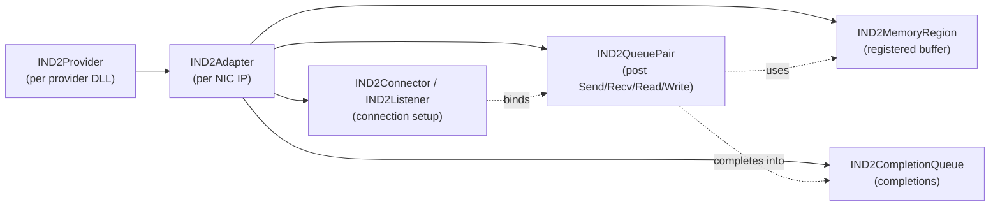

# Getting Started with NetworkDirect

This page gets you from "what is this?" to a running RDMA program. After
reading it you will understand the ND mental model, know the eight steps
every ND program performs, and have built and run the bundled examples.

## 1. What problem does NetworkDirect solve?

Berkeley sockets push every byte through the kernel TCP/IP stack: copy into
a kernel buffer, traverse the stack, fire an interrupt, copy back out.
That's fine at 1 Gb/s; at 100 Gb/s the CPU spends more time shuffling
bytes than your application spends doing real work.

NetworkDirect is Microsoft's **RDMA** (Remote Direct Memory Access)
service-provider interface on Windows. The provider DLL talks to a
kernel-bypass-capable NIC, and your user-mode process gets to:

- **Post I/O directly to the hardware** — no syscall per send.
- **Reap completions directly from the hardware** — no syscall per receive.
- **DMA between application buffers and the wire** — no extra copies.
- **Read and write peer memory directly** — one-sided RDMA, no CPU on the
  remote side.

The price is a more involved setup phase and stricter rules around
buffers, queue depths, and ordering.

## 2. Mental model

Five things drive everything in ND. Internalise them now and the rest of
the SPI falls into place.



| Concept | What it is | Sockets analogy |
|---------|------------|-----------------|
| **Adapter** | Handle on one RDMA NIC's IP address. | A `WSADATA`/socket factory bound to a NIC. |
| **Memory Region (MR)** | A pinned, hardware-addressable view of one of your buffers. | The `recv`/`send` buffer — except the hardware reads/writes it directly. |
| **Queue Pair (QP)** | The send + receive endpoint. You post requests here. | A connected socket. |
| **Completion Queue (CQ)** | Hardware-fed FIFO of "this request finished". | Win32 IOCP, but specific to ND work requests. |
| **Connector / Listener** | RDMA connection handshake. | `connect` / `listen` + `accept`. |

The two-sided operations look just like sockets:

- **Send** posts an outbound message — the peer must have posted a
  matching **Receive** first.

One-sided operations are the magic ingredient:

- **RDMA Write** drops bytes straight into a buffer on the remote machine
  without the remote CPU being involved.
- **RDMA Read** pulls bytes straight out of a remote buffer.

## 3. The eight steps every ND program performs

Almost every ND application — client or server — runs through these eight
steps in this order. Bookmark this list; it is the table of contents for
the rest of the tutorial.

1. **Bootstrap.** `WSAStartup`, `NdStartup`, resolve a usable adapter IP.
2. **Open an adapter.** `NdOpenAdapter` gives you an [IND2Adapter](../IND2Adapter.md).
3. **Create an overlapped file.** `IND2Adapter::CreateOverlappedFile` —
   the kernel handle that all async ops hang off of.
4. **Create a completion queue.** Sized to your maximum outstanding work.
5. **Register memory.** `CreateMemoryRegion` + `Register` for every
   buffer the NIC will touch.
6. **Create a queue pair.** Bound to the CQ; this is the I/O endpoint.
7. **Establish the connection.** Server: `CreateListener` → `Bind` →
   `Listen` → `GetConnectionRequest` → `Accept`. Client: `CreateConnector`
   → `Connect` → `CompleteConnect`.
8. **Exchange data** by posting `Send`/`Receive`/`Read`/`Write` and
   reaping completions from the CQ. Tear down with `Disconnect` →
   `Deregister` → `Release`.

The rest of this page walks you through the absolute minimum code for each
step. Deep dives for steps 4–8 live in their own pages.

## 4. Prerequisites and build

You need:

- Visual Studio 2017 (or later), Windows SDK, and Windows WDK installed.
  See the [top-level README](../../README.md#prerequisites) for exact
  versions to set in `Directory.Build.props`.
- At least one machine with an RDMA-capable NIC, drivers installed, and an
  IP address assigned.

Build everything from a *Native Tools Command Prompt for Visual Studio*:

```
cd <repo root>
msbuild
```

The example binaries land in `bin\<arch>\<config>\`. Add that directory to
your `PATH` for the rest of this tutorial.

## 5. Smoke-test: list the RDMA addresses on your box

The smallest meaningful ND program just enumerates the IP addresses that
ND providers know about. The repo ships it as
[ndcat](../../src/examples/ndcat/ndcat.cpp). Run it against any IP and it
will print a list of all ND-capable addresses:

```
> ndcat 10.0.0.1
Retrieving the full Addresslist
Validation of full Addresslist passed
```

If `ndcat` errors with `ND_INVALID_ADDRESS`, no provider claims that IP —
double-check that an RDMA NIC is up on that subnet.

## 6. Inspect an adapter's capabilities

Once `ndcat` succeeds, dump the adapter's limits with
[ndadapterinfo](../../src/examples/ndadapterinfo/ndadapterinfo.cpp):

```
> ndadapterinfo 10.0.0.1
InfoVersion: 2
VendorId: ...
MaxInitiatorQueueDepth: 16351
MaxReceiveQueueDepth:    16351
MaxCompletionQueueDepth: 65407
MaxInlineDataSize:       236
MaxTransferLength:       1073741824
...
```

You will read these numbers from your own code every time you size a
queue pair or completion queue — never hard-code them. The full structure
is documented under
[ND2_ADAPTER_INFO](../IND2Adapter.md#nd2_adapter_info-structure).

## 7. "Hello, RDMA" — the smallest working client/server

The shape of every ND program is the same. Below is a stripped-down
walkthrough of [ndping](../../src/examples/ndping/ndping.cpp); compare it
side-by-side with the helpers in
[ndtestutil.cpp](../../src/examples/ndtestutil/ndtestutil.cpp) for the
real-world version.

### Common setup (client and server)

```cpp
#include <ndspi.h>
#include <ndsupport.h>     // NdStartup, NdOpenAdapter helpers
#include <ws2tcpip.h>

WSADATA wsa;
WSAStartup(MAKEWORD(2, 2), &wsa);
NdStartup();

// 1. Pick a local sockaddr_in that lives on an RDMA NIC.
sockaddr_in local = ...;       // e.g. parsed from argv

// 2. Open the adapter for that address.
IND2Adapter* pAdapter = nullptr;
NdOpenAdapter(IID_IND2Adapter,
              reinterpret_cast<sockaddr*>(&local), sizeof(local),
              reinterpret_cast<void**>(&pAdapter));

// 3. Get the overlapped-I/O file handle every async op will share.
HANDLE hFile = nullptr;
pAdapter->CreateOverlappedFile(&hFile);

// 4. Query capabilities so we don't exceed hardware limits.
ND2_ADAPTER_INFO info{};
info.InfoVersion = ND_VERSION_2;
ULONG cb = sizeof(info);
pAdapter->Query(&info, &cb);

// 5. Allocate and register a 4 KiB buffer for messages.
char* pBuf = new char[4096];
IND2MemoryRegion* pMr = nullptr;
pAdapter->CreateMemoryRegion(IID_IND2MemoryRegion, hFile,
                             reinterpret_cast<void**>(&pMr));

OVERLAPPED ov{};
ov.hEvent = CreateEvent(nullptr, FALSE, FALSE, nullptr);
HRESULT hr = pMr->Register(pBuf, 4096,
                           ND_MR_FLAG_ALLOW_LOCAL_WRITE, &ov);
if (hr == ND_PENDING)
    hr = pMr->GetOverlappedResult(&ov, TRUE);

// 6. Create a completion queue and queue pair.
IND2CompletionQueue* pCq = nullptr;
pAdapter->CreateCompletionQueue(IID_IND2CompletionQueue, hFile,
                                /*queueDepth*/ 16,
                                /*group*/ 0, /*affinity*/ 0,
                                reinterpret_cast<void**>(&pCq));

IND2QueuePair* pQp = nullptr;
pAdapter->CreateQueuePair(IID_IND2QueuePair, pCq, pCq, /*context*/ nullptr,
                          /*recvDepth*/ 16, /*initDepth*/ 16,
                          /*recvSge*/ 1,   /*initSge*/ 1,
                          /*inline*/ 0,
                          reinterpret_cast<void**>(&pQp));

IND2Connector* pConnector = nullptr;
pAdapter->CreateConnector(IID_IND2Connector, hFile,
                          reinterpret_cast<void**>(&pConnector));
```

After this block both sides have an adapter, a CQ, a QP, a connector,
and one registered 4 KiB buffer. Up to here everything is identical
client-side and server-side.

### Server: listen and accept

```cpp
IND2Listener* pListen = nullptr;
pAdapter->CreateListener(IID_IND2Listener, hFile,
                         reinterpret_cast<void**>(&pListen));

pListen->Bind(reinterpret_cast<sockaddr*>(&local), sizeof(local));
pListen->Listen(/*backlog*/ 0);

// Post a Receive *before* accepting — iWARP requires it.
ND2_SGE sge{ pBuf, 4096, pMr->GetLocalToken() };
pQp->Receive(/*ctx*/ nullptr, &sge, 1);

// Wait for an incoming connection request and accept it.
pListen->GetConnectionRequest(pConnector, &ov);
pConnector->GetOverlappedResult(&ov, TRUE);

pConnector->Accept(pQp, /*inboundRead*/ 0, /*outboundRead*/ 0,
                   /*privateData*/ nullptr, 0, &ov);
pConnector->GetOverlappedResult(&ov, TRUE);
```

### Client: connect

```cpp
sockaddr_in remote = ...;   // server IP/port

pConnector->Bind(reinterpret_cast<sockaddr*>(&local), sizeof(local));
pConnector->Connect(pQp,
                    reinterpret_cast<sockaddr*>(&remote), sizeof(remote),
                    /*inboundRead*/ 0, /*outboundRead*/ 0,
                    /*privateData*/ nullptr, 0, &ov);
pConnector->GetOverlappedResult(&ov, TRUE);

pConnector->CompleteConnect(&ov);
pConnector->GetOverlappedResult(&ov, TRUE);
```

### Exchange one message

```cpp
// Client posts a Send; server's pre-posted Receive will catch it.
ND2_SGE sge{ pBuf, 13, pMr->GetLocalToken() };
memcpy(pBuf, "hello, RDMA!", 13);
pQp->Send(/*ctx*/ nullptr, &sge, 1, /*flags*/ 0);

// Both sides poll the CQ until completion shows up.
ND2_RESULT result{};
while (pCq->GetResults(&result, 1) == 0) { /* spin or block on Notify */ }
```

### Teardown

```cpp
pConnector->Disconnect(&ov);
pConnector->GetOverlappedResult(&ov, TRUE);

pMr->Deregister(&ov);
pMr->GetOverlappedResult(&ov, TRUE);

// COM-style: Release everything in reverse-creation order.
pListen ? pListen->Release() : 0;
pConnector->Release();
pQp->Release();
pCq->Release();
pMr->Release();
CloseHandle(hFile);
pAdapter->Release();
delete[] pBuf;
NdCleanup();
WSACleanup();
```

That's an end-to-end ND program in under 100 lines. Every other example
in the repo is this same skeleton with more buffers, deeper queues, and
domain-specific logic on top.

## 8. Running the bundled examples

Once you can list addresses, the easiest way to verify a real two-machine
setup is the bundled benchmarks:

```
:: On host A (server)
ndpingpong -s 10.0.0.1

:: On host B (client)
ndpingpong -c 10.0.0.1
```

`ndpingpong` prints latency in microseconds and throughput in B/s for
message sizes from 1 byte to 4 MiB. Numbers in the **single-digit
microsecond** range mean your fabric is healthy.

Switch to `ndrping` to exercise one-sided RDMA Write or Read instead, and
to `ndrpingpong` for an RDMA-Write ping-pong that never involves the
remote CPU.

## 9. Where to go next

You now know the cast of characters and the shape of an ND program. Pick
a deep dive based on what you need to do:

- "I'm not sure what each object owns or who releases what" →
  [Objects & lifecycles](./02-objects-and-lifecycles.md).
- "I need to negotiate a connection with custom parameters" →
  [Connection establishment](./03-connections.md).
- "I want to push or pull bytes as fast as possible" →
  [Data transfer](./04-data-transfer.md).
- "How do I integrate this with my IOCP-based server?" →
  [Asynchronous completions](./05-completions-and-async.md).
- "Why does my Register call return `ND_PENDING`?" →
  [Memory regions & windows](./06-memory.md).
- "I need flow control / SRQs / pipelining" →
  [Advanced patterns](./07-advanced-patterns.md).
