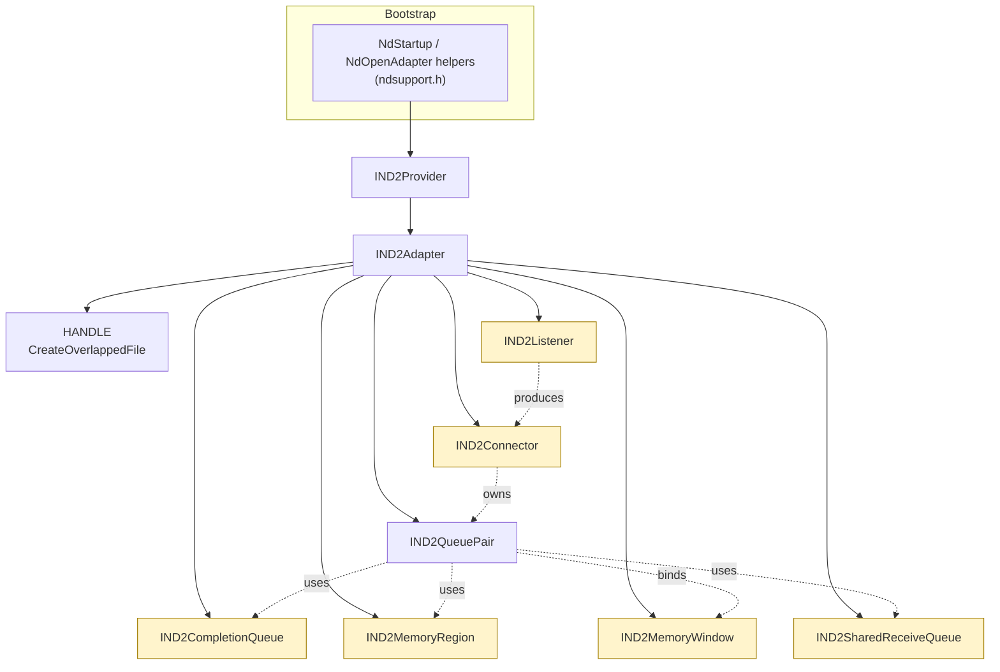
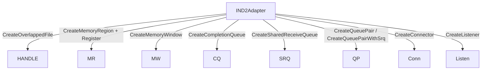
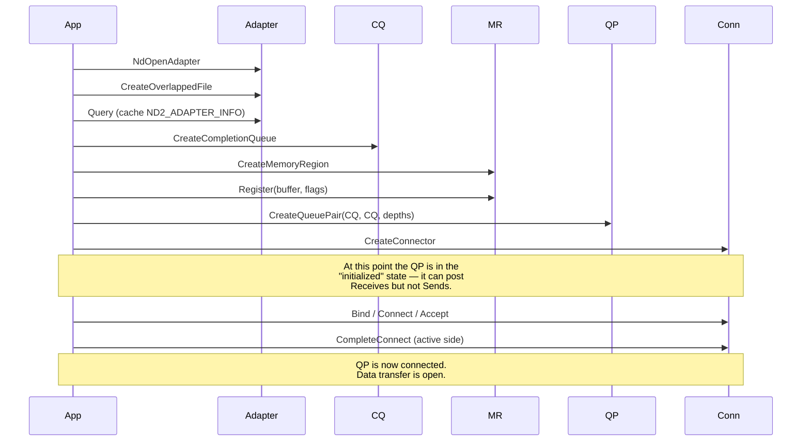

# Objects & Lifecycles

The ND SPI is built from a small set of COM-style interfaces. This page
catalogues every object, explains who creates it and who owns it, and
shows the order in which they must be created and torn down.

> Reference: every interface name below links to its full method list in
> the [reference docs](../NetworkDirectSPI.md).

## 1. The full object graph



The shaded objects inherit from [IND2Overlapped](../IND2Overlapped.md);
that's how you tell at a glance which APIs can complete asynchronously.

## 2. The cast, one by one

### IND2Provider

The DLL entry point. You almost never touch it directly — the
[ndsupport](../../src/ndutil/ndsupport.h) helpers
(`NdStartup`, `NdOpenAdapter`, `NdQueryAddressList`, `NdResolveAddress`,
`NdCheckAddress`, `NdCleanup`) hide it. Internally they:

1. Enumerate ND providers with `WSCEnumProtocols`.
2. Load the provider DLL via `WSCGetProviderPath` + `LoadLibrary`.
3. Instantiate `IND2Provider` through the DLL's `DllGetClassObject`.

Reach for `IND2Provider` directly only when you need provider-specific
extensions exposed through `QueryInterface`. Full surface:
[IND2Provider](../IND2Provider.md).

### IND2Adapter

A handle on **one NIC, identified by IP address**. You get it from
`NdOpenAdapter` (or `IND2Provider::OpenAdapter`). Multiple `IND2Adapter`
instances can refer to the same physical NIC if it has multiple IPs.

Important methods you will call right after opening it:

- `Query` — fill in an [ND2_ADAPTER_INFO](../IND2Adapter.md#nd2_adapter_info-structure)
  and treat the limits as gospel.
- `CreateOverlappedFile` — the kernel handle every async object shares.

Everything else (CQ, MR, MW, QP, connector, listener, SRQ) is created
*from* the adapter. The adapter is therefore the root of all your
resources — release it last. See [IND2Adapter](../IND2Adapter.md).

### Overlapped file handle

Not an interface — just a `HANDLE`. Every overlapped operation on every
object created from the same adapter dispatches through this handle.
That means it is the natural object to bind to an IOCP. You can call
`BindIoCompletionCallback` or `CreateIoCompletionPort` on it just like
any other Win32 handle.

Implementation notes worth knowing:

- Providers set `FILE_SKIP_COMPLETION_PORT_ON_SUCCESS` and
  `FILE_SKIP_SET_EVENT_ON_HANDLE`. Synchronous success (`ND_SUCCESS`) does
  **not** post to IOCP and does **not** signal the event. Only
  `ND_PENDING` ever results in a later notification.
- Don't `CloseHandle` it until every object created against it has been
  released.

### IND2CompletionQueue

A FIFO of [ND2_RESULT](../IND2CompletionQueue.md#nd2_result-structure)
entries — the hardware writes here, you drain it.

Key facts:

- Created with a fixed `queueDepth`. If you queue more outstanding
  requests across all bound QPs than this, the CQ overruns and goes
  unusable.
- Multiple QPs can share one CQ. Both the initiator (Send/Read/Write
  /Bind/Invalidate) and receive sides of a QP can target the same CQ or
  separate CQs — that's why `CreateQueuePair` takes two CQ pointers.
- `GetResults` is the polling primitive; `Notify` is the blocking
  primitive. They are designed to work together — see
  [Async completions](./05-completions-and-async.md).

Full surface: [IND2CompletionQueue](../IND2CompletionQueue.md).

### IND2MemoryRegion

A pinned, NIC-addressable view of one of your buffers. RDMA hardware
cannot DMA into unpinned virtual memory, so every byte that the NIC
touches (whether as a Send source, a Receive sink, or a Read/Write
target) must live inside a registered region.

Creation is a two-step dance:

1. `CreateMemoryRegion` — allocates the kernel-side bookkeeping object.
2. `Register` — pins the user buffer and produces local/remote tokens.

`Register` is the only step that can return `ND_PENDING`; it's also the
most expensive call in the SPI, sometimes by orders of magnitude. Cache
registrations whenever you can. The full lifecycle, access flags, and
trade-offs live in [Memory regions & windows](./06-memory.md).

### IND2MemoryWindow

A *subset* of an MR that you can hand to a peer for a bounded period of
time. You create one (in the "invalidated" state) from the adapter, then
bind it to a buffer inside an MR via `IND2QueuePair::Bind`. The peer
uses its remote token in `Read`/`Write` requests, and you can revoke it
with `IND2QueuePair::Invalidate`.

Use windows when:

- You want to register a large buffer once but only expose a small slice
  to the peer per request.
- You want to revoke remote access without deregistering the underlying
  memory.

Skip windows and use the MR's own remote token when peers always have
access to the whole region. Reference:
[IND2MemoryWindow](../IND2MemoryWindow.md).

### IND2SharedReceiveQueue

Optional. A pool of Receive descriptors shared by many QPs. Useful when
you have hundreds of connections and don't want to per-QP-allocate
worst-case-sized Receive backlogs. Support is feature-flagged: check
`MaxSharedReceiveQueueDepth` in `ND2_ADAPTER_INFO` before using one.

Pair it with `CreateQueuePairWithSrq` instead of `CreateQueuePair`. See
[Advanced patterns](./07-advanced-patterns.md#shared-receive-queues) and
[IND2SharedReceiveQueue](../IND2SharedReceiveQueue.md).

### IND2QueuePair

The data-transfer endpoint. Once it's connected you call:

- `Send` / `Receive` for two-sided messaging.
- `Read` / `Write` for one-sided RDMA.
- `Bind` / `Invalidate` for memory-window management.
- `Flush` to cancel everything outstanding without disconnecting.

Important sizing knobs (all set at creation, never changed):

- `receiveQueueDepth` / `initiatorQueueDepth` — outstanding-request caps.
- `maxReceiveRequestSge` / `maxInitiatorRequestSge` — SGE-list lengths.
- `inlineDataSize` — bytes the QP can stash inside the work request itself.

Reference: [IND2QueuePair](../IND2QueuePair.md).

### IND2Connector

The active-side connection object. It owns the actual TCP-port-equivalent
binding for a single connection. Lifecycle:

1. `Bind` to a local address (port 0 = ephemeral).
2. `Connect(QP, remoteAddr, ...)` → wait for completion.
3. (Optional) `GetReadLimits` / `GetPrivateData` to inspect server reply.
4. `CompleteConnect` to flip the QP to the connected state, **or**
   `Reject` to bail out.
5. Data phase.
6. `Disconnect` (implicitly flushes all outstanding requests).

On the passive side, the listener hands you a connector via
`GetConnectionRequest`; you `Accept` or `Reject` it.

A connector hosts exactly one QP at a time. After disconnecting, the QP
is dead — release it and create a new one for the next connection.
Reference: [IND2Connector](../IND2Connector.md).

### IND2Listener

The passive-side accept primitive. `Bind` it to a local sockaddr, call
`Listen`, then issue `GetConnectionRequest` (overlapped) with a
*pre-created* connector. Each completion hands you back a connector ready
for `Accept`.

You can post multiple `GetConnectionRequest` calls in flight — they
complete one per incoming connection — which is the standard recipe for
servers that need to accept a steady stream without dropping requests.
Reference: [IND2Listener](../IND2Listener.md).

## 3. Who can be created from whom



A few derived rules fall out of this:

- Every object that takes `hOverlappedFile` (MR, CQ, QP via CQ, Connector,
  Listener) must use a handle obtained from **the same adapter**. Don't
  cross-pollinate handles.
- You can share one MR across many QPs and one CQ across many QPs, as
  long as they all live under the same adapter.
- An MW must be bound to an MR and QP that all live under the same adapter.
- A connector can host only **one** QP at a time. The QP can't be reused
  for a second connection.

## 4. Construction order



Two construction-time gotchas worth remembering:

- **Post Receives before you let the connection complete.** iWARP fabrics
  require the passive side to have a receive ready before its first
  Send. The ND examples post receives between `GetConnectionRequest` and
  `Accept`; the [Connections page](./03-connections.md) explains the
  protocol in detail.
- **Don't size a QP against numbers you wished for.** Read
  `MaxInitiatorQueueDepth`, `MaxReceiveQueueDepth`,
  `MaxCompletionQueueDepth`, `MaxInitiatorSge`, `MaxReceiveSge`, and
  `MaxInlineDataSize` from `ND2_ADAPTER_INFO` first and `min()` against
  them.

## 5. Teardown order

Releasing ND objects is COM reference counting (`Release`), but the order
matters because of the cross-object relationships. The rule of thumb:
**tear down in the reverse of how you built up**, and do the explicit
disconnect/deregister calls before `Release`.

```cpp
// 1. Quiesce I/O.
pConnector->Disconnect(&ov);          // flushes pending requests on QP
pConnector->GetOverlappedResult(&ov, TRUE);

// 2. Unpin any registered memory.
pMr->Deregister(&ov);
pMr->GetOverlappedResult(&ov, TRUE);

// 3. Drop COM references (reverse creation order).
if (pListen)    pListen->Release();
pConnector->Release();
pQp->Release();
if (pSrq)       pSrq->Release();
if (pMw)        pMw->Release();
pMr->Release();
pCq->Release();

// 4. Close the shared overlapped handle.
CloseHandle(hFile);

// 5. Release the adapter last.
pAdapter->Release();

// 6. Bootstrap shutdown.
NdCleanup();
WSACleanup();
```

The [ndtestutil base class](../../src/examples/ndtestutil/ndtestutil.cpp)
demonstrates a destructor doing the same dance with null checks — copy
that pattern in your own code.

Two failure modes to watch for:

- **Releasing the MR with a window still bound** returns `ND_DEVICE_BUSY`
  on `Deregister`. Invalidate the MW first, or release the MW first.
- **Releasing the QP without disconnecting** is legal — the provider
  performs an implicit disconnect — but in-flight requests will complete
  with `ND_CANCELED` and you might miss completions you cared about.

## 6. State diagram for a queue pair

The QP's connection state changes the set of legal operations:

```mermaid
stateDiagram-v2
    [*] --> Initialized: CreateQueuePair
    Initialized --> Connecting: Connector::Connect (client)
    Initialized --> Connecting: Connector::Accept (server)
    Connecting --> Connected: CompleteConnect / Accept completes
    Connecting --> Dead: Reject / Disconnect / error
    Connected --> Dead: Disconnect / fatal completion / Release
    Dead --> [*]
```

- **Initialized**: only `Receive` is allowed; `Send`/`Read`/`Write` return
  `ND_CONNECTION_INVALID`.
- **Connected**: all data-transfer methods are allowed.
- **Dead**: only `Flush` and `Release` are useful; everything else is an
  error.

A single fatal completion status (anything other than `ND_SUCCESS` or
`ND_CANCELED` coming back from `GetResults`) terminates the connection
and moves the QP to **Dead**. All subsequent outstanding requests
complete with `ND_CANCELED`.

## 7. Cheat-sheet: which interface owns which method

| Need to… | Call… |
|----------|-------|
| Enumerate addresses | `NdQueryAddressList` |
| Open an adapter for an IP | `NdOpenAdapter` |
| Read adapter limits | `IND2Adapter::Query` |
| Create the shared OVERLAPPED handle | `IND2Adapter::CreateOverlappedFile` |
| Pin a buffer | `IND2MemoryRegion::Register` |
| Sub-divide / revoke a buffer to/from a peer | `IND2MemoryWindow` + `IND2QueuePair::Bind`/`Invalidate` |
| Hold completions | `IND2CompletionQueue` |
| Post a two-sided message | `IND2QueuePair::Send` / `IND2QueuePair::Receive` |
| Do one-sided RDMA | `IND2QueuePair::Read` / `IND2QueuePair::Write` |
| Listen | `IND2Listener::Bind` + `Listen` + `GetConnectionRequest` |
| Connect | `IND2Connector::Bind` + `Connect` + `CompleteConnect` |
| Hand off Receives to a pool | `IND2SharedReceiveQueue` + `CreateQueuePairWithSrq` |
| Wait for any completion | `IND2CompletionQueue::Notify` |
| Get the result of an async op | `IND2Overlapped::GetOverlappedResult` |

Continue with [Connection establishment](./03-connections.md) to see how
the connector + listener handshake actually works.
