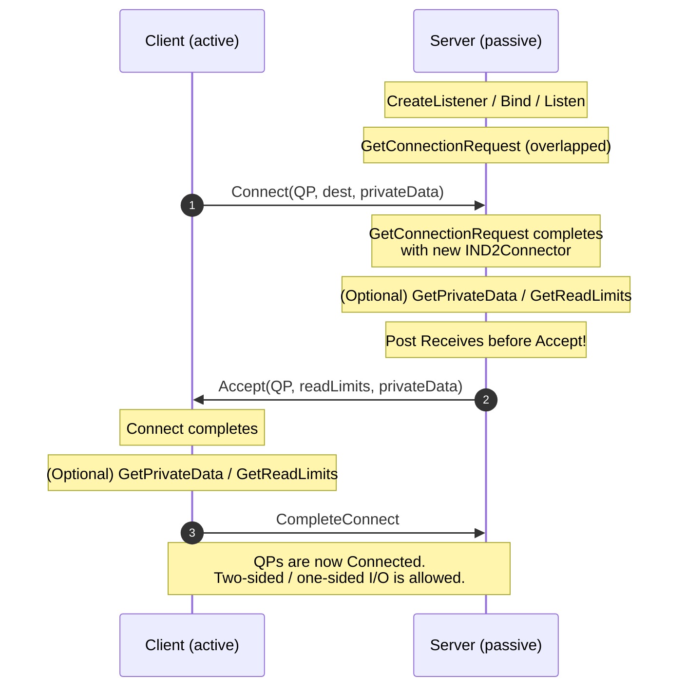

# Connection Establishment

NetworkDirect uses an **active / passive** model. The passive side
listens, the active side connects, and they exchange a few asynchronous
handshake messages before any data transfer starts. This page walks the
handshake end-to-end, calls out the iWARP-specific ordering rules,
explains private data and read limits, and shows how to disconnect
cleanly.

> Reference: [IND2Connector](../IND2Connector.md), [IND2Listener](../IND2Listener.md).

## 1. The handshake at a glance



Six wire round-trips collapse into three logical phases:

1. **Discover** — server `Listen`s, client `Connect`s. The server's
   `GetConnectionRequest` completes with a brand-new connector pre-loaded
   with the request.
2. **Negotiate** — both sides can read the peer's *private data* and
   *read limits* before committing. The server's `Accept` (or `Reject`)
   transfers the final values back. The client commits with
   `CompleteConnect`.
3. **Transfer** — both QPs are connected; data flows.

## 2. Passive side (server) — step by step

```cpp
// (0) Bootstrap and have:
//     IND2Adapter*      pAdapter;
//     HANDLE            hFile;
//     IND2QueuePair*    pQp;
//     IND2Connector*    pConnector;  // already created from pAdapter

// (1) Create the listener.
IND2Listener* pListen = nullptr;
pAdapter->CreateListener(IID_IND2Listener, hFile,
                         reinterpret_cast<void**>(&pListen));

// (2) Bind to the listening sockaddr. Port 0 = ephemeral.
sockaddr_in local = ...;          // port chosen by you
pListen->Bind(reinterpret_cast<sockaddr*>(&local), sizeof(local));

// (3) Start listening.
pListen->Listen(/*backlog*/ 0);    // 0 = provider's default

// (4) Wait for the next connect request.
//     The connector you pass in will be populated.
OVERLAPPED ov{}; ov.hEvent = CreateEvent(nullptr, FALSE, FALSE, nullptr);
HRESULT hr = pListen->GetConnectionRequest(pConnector, &ov);
if (hr == ND_PENDING)
    hr = pListen->GetOverlappedResult(&ov, TRUE);

// (5) Optional: inspect what the client sent.
ULONG cbPriv = 0;
pConnector->GetPrivateData(nullptr, &cbPriv);   // -> ND_BUFFER_OVERFLOW
std::vector<char> priv(cbPriv);
pConnector->GetPrivateData(priv.data(), &cbPriv);

ULONG inboundReadLimitReq = 0, outboundReadLimitReq = 0;
pConnector->GetReadLimits(&inboundReadLimitReq, &outboundReadLimitReq);

// (6) Post Receives BEFORE accepting (iWARP rule — see §5).
ND2_SGE sge{ pBuf, bufLen, pMr->GetLocalToken() };
pQp->Receive(/*ctx*/ nullptr, &sge, 1);

// (7) Commit.
hr = pConnector->Accept(pQp,
                        /*inboundRead*/  myInboundLimit,
                        /*outboundRead*/ myOutboundLimit,
                        /*privateData*/  serverReply, cbReply,
                        &ov);
if (hr == ND_PENDING)
    hr = pConnector->GetOverlappedResult(&ov, TRUE);

// Or refuse, optionally with a reason in private data:
// pConnector->Reject(reasonBuf, cbReason);
```

To accept multiple clients concurrently, post several
`GetConnectionRequest` calls in flight — each completes with a separate
connector (which means you also need to pre-create several connectors and
pre-allocate several QPs). Don't reuse a connector for a second
connection; release it after `Disconnect`.

## 3. Active side (client) — step by step

```cpp
// (1) Optionally bind to a specific local sockaddr.
//     Port 0 lets the provider pick.
sockaddr_in local = ...;
pConnector->Bind(reinterpret_cast<sockaddr*>(&local), sizeof(local));

// (2) Issue the connect.
OVERLAPPED ov{}; ov.hEvent = CreateEvent(nullptr, FALSE, FALSE, nullptr);
sockaddr_in dest = ...;
HRESULT hr = pConnector->Connect(
    pQp,
    reinterpret_cast<sockaddr*>(&dest), sizeof(dest),
    /*inboundRead*/  myInboundLimit,
    /*outboundRead*/ myOutboundLimit,
    /*privateData*/  clientHello, cbHello,
    &ov);
if (hr == ND_PENDING)
    hr = pConnector->GetOverlappedResult(&ov, TRUE);

// (3) Optional: inspect server's reply before committing.
ULONG cbPriv = 0;
pConnector->GetPrivateData(nullptr, &cbPriv);
std::vector<char> serverReply(cbPriv);
pConnector->GetPrivateData(serverReply.data(), &cbPriv);

ULONG finalInbound = 0, finalOutbound = 0;
pConnector->GetReadLimits(&finalInbound, &finalOutbound);

// You can still bail out here:
// pConnector->Reject(nullptr, 0);

// (4) Commit — this flips the QP to Connected.
hr = pConnector->CompleteConnect(&ov);
if (hr == ND_PENDING)
    hr = pConnector->GetOverlappedResult(&ov, TRUE);
```

After `CompleteConnect` returns success, `pQp->Send`,
`pQp->Read`, and `pQp->Write` are all legal. Before that they return
`ND_CONNECTION_INVALID`.

## 4. Private data: a tiny built-in negotiation channel

Both `Connect` and `Accept` carry an opaque private-data blob. Use it
for whatever your protocol needs to negotiate before the first Send —
buffer sizes, version numbers, advertised remote-token + remote-address
pairs.

Three rules:

- The maximum sizes are reported by `MaxCallerData` (Connect/Reject) and
  `MaxCalleeData` (Accept/Reject) in [ND2_ADAPTER_INFO](../IND2Adapter.md#nd2_adapter_info-structure).
  Exceeding them is `ND_INVALID_BUFFER_SIZE`.
- Read it with `GetPrivateData(nullptr, &cb)` first to size the buffer,
  then again with the real buffer.
- The blob is opaque to the provider — you choose the layout, and you're
  responsible for endianness if you cross architectures.

The [ndping client](../../src/examples/ndping/ndping.cpp) shows this
idiom: the server sends back its receive-queue depth as private data so
the client knows how many credits it starts with.

## 5. Read limits

`inboundReadLimit` and `outboundReadLimit` cap the number of in-flight
RDMA *Read* requests for the connection:

- **`outboundReadLimit`** — how many Reads *you* will initiate.
- **`inboundReadLimit`** — how many concurrent Reads *the peer* may
  initiate against your memory.

If your application never issues `Read`, set both to 0 — that avoids the
adapter dedicating resources to a feature you don't use.

The negotiation is implicit. Each side names its preferred limits in
`Connect`/`Accept`. The provider silently lowers them to the adapter
ceiling (`MaxInboundReadLimit` / `MaxOutboundReadLimit`). The final
values are visible from `GetReadLimits` after the call completes — that
is when you decide whether the negotiated values are workable or whether
to `Reject` / not `CompleteConnect`.

## 6. The iWARP "post-Receives-before-Accept" rule

> iWARP requires the *passive* side to issue at least one `Receive`
> before the connection completes, and that the *active* side must
> always be the one to Send first.

In practice this means:

- The server posts Receives **between** `GetConnectionRequest` and
  `Accept`. Look at [ndping.cpp](../../src/examples/ndping/ndping.cpp):
  it posts `m_queueDepth` Receives before accepting.
- The client may post its Receives any time before its first expected
  Send.
- After connect, the client should be the one to send first. If your
  protocol can't guarantee that, just have the client send a zero-byte
  SYNC message before the server starts talking.

InfiniBand fabrics don't enforce this strictly, but writing your code
this way means the same binary works on either fabric.

## 7. Errors during connection

A few errors deserve special handling because they imply different next
steps:

| HRESULT | Recoverable? | What to do |
|---------|--------------|------------|
| `ND_PENDING` | yes | Wait via `GetOverlappedResult`. |
| `ND_CONNECTION_REFUSED` | retry-able | No listener, backlog full, or peer `Reject`ed. |
| `ND_NETWORK_UNREACHABLE`, `ND_HOST_UNREACHABLE` | retry-able | Fabric problem. Pause and retry. |
| `ND_IO_TIMEOUT` | retry-able | Peer too slow to accept / complete. Retry. |
| `ND_CONNECTION_ACTIVE` | no | The QP is already connected — start over with a fresh QP. |
| `ND_DEVICE_REMOVED` | no | The NIC went away. Reopen the adapter. |
| `ND_INVALID_BUFFER_SIZE` | no | Private data exceeded `MaxCallerData`/`MaxCalleeData`. |

If `Connect` or `Accept` fails immediately (anything other than
`ND_SUCCESS` or `ND_PENDING`), the connector is dead — release it and
make a fresh one before retrying.

## 8. Disconnecting cleanly

Either side can initiate disconnect:

```cpp
OVERLAPPED ov{}; ov.hEvent = CreateEvent(nullptr, FALSE, FALSE, nullptr);
HRESULT hr = pConnector->Disconnect(&ov);
if (hr == ND_PENDING)
    hr = pConnector->GetOverlappedResult(&ov, TRUE);
```

`Disconnect` does three things implicitly:

1. **Flush** every outstanding request on the QP — they will surface
   from `GetResults` with `Status == ND_CANCELED`. Drain them.
2. Mark the QP unusable for further data ops.
3. Tear down the wire-level connection with the peer.

If you want a heads-up that the peer started a disconnect, post
`NotifyDisconnect(&ov)` after connecting. The overlapped op completes
when the wire-level FIN arrives, giving you a chance to drain the CQ
before your own teardown.

## 9. Putting it together — ASCII timeline

```
time
 │
 │  server.Listen()
 │  server.GetConnectionRequest(connectorS, &ov)   ─┐
 │                                                  │ (overlapped)
 │  client.Connect(qpC, server, ...)  ─────────────►│
 │                                                  ▼
 │                                  server: GCR completes
 │                                  server: PostReceive(...)
 │                                  server.Accept(qpS, ..., &ov)
 │  client: Connect completes                        │
 │  client: GetPrivateData() if desired              │
 │                                  server: Accept completes
 │  client.CompleteConnect(&ov)                      │
 │  client: CompleteConnect completes                │
 │  ┌────────── connected ──────────┐                │
 │  client.Send(...)                                  │
 │                            server: Receive completes
 │  ...                                               │
 │  client.Disconnect(&ov)                            │
 │                            server: outstanding requests → ND_CANCELED
 │                            server.Disconnect(&ov)
 ▼
```

## 10. Putting it into code: ndtestutil's helpers

If you do not want to re-implement the boilerplate, the
[ndtestutil](../../src/examples/ndtestutil/ndtestutil.cpp) helper class
already wraps the entire handshake into a handful of methods:

```cpp
// Server
NdTestBase::Init(local);
NdTestBase::CreateCQ(depth);
NdTestBase::CreateConnector();
NdTestBase::CreateQueuePair(depth, nSge);
NdTestServerBase::CreateListener();
NdTestServerBase::Listen(local);
NdTestServerBase::GetConnectionRequest();
// PostReceive(...) here
NdTestServerBase::Accept(inboundRead, outboundRead,
                         /*priv*/ nullptr, 0);

// Client
NdTestBase::Init(local);
NdTestBase::CreateCQ(depth);
NdTestBase::CreateConnector();
NdTestBase::CreateQueuePair(depth, nSge);
NdTestClientBase::Connect(local, dest, inboundRead, outboundRead);
NdTestClientBase::CompleteConnect();
```

That's the entire connection setup for `ndping`, `ndpingpong`, `ndrping`,
and `ndrpingpong`. Read the helper source — it is the cleanest condensed
example of the rules above.

Next: [Data transfer](./04-data-transfer.md).
