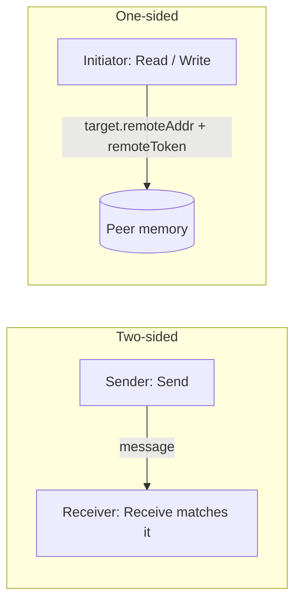

# Data Transfer

Once a queue pair is connected, four data-transfer verbs are available:
`Send`, `Receive`, `Read`, and `Write`. This page explains the two
families they form, the scatter/gather list format every request uses,
the flags that meaningfully change behaviour, and the ordering and
buffer-sizing rules you cannot ignore.

> Reference: [IND2QueuePair](../IND2QueuePair.md),
> [ND2_SGE](../IND2QueuePair.md#nd2_sge-structure),
> [ND2_RESULT](../IND2CompletionQueue.md#nd2_result-structure).

## 1. Two families: two-sided vs. one-sided



| | Two-sided (Send/Receive) | One-sided (Read/Write) |
|--|--|--|
| Wire op | Send / Receive | RDMA Read / RDMA Write |
| Remote CPU involvement | The peer **must** post a matching Receive first. | None. Hardware DMAs straight into/out of the registered buffer. |
| Discovers a destination by | A pre-posted receive descriptor. | A `remoteAddress` + `remoteToken` you got out-of-band. |
| When to use | Control messages, RPC-style request/reply, anything where the receiver doesn't know which buffer to use until the message arrives. | Bulk transfers, anything large enough that the per-message setup cost dominates. |
| Crossover point | — | Use Send below `LargeRequestThreshold`, RDMA above. The adapter reports this — see [ND2_ADAPTER_INFO](../IND2Adapter.md#nd2_adapter_info-structure). |

Real applications usually mix the two: a tiny Send carrying a control
header that contains a `remoteAddress` + `remoteToken`, followed by an
RDMA `Read` or `Write` for the bulk payload. That's exactly what
[ndrping.cpp](../../src/examples/ndrping/ndrping.cpp) and
[ndrpingpong.cpp](../../src/examples/ndrpingpong/ndrpingpong.cpp)
demonstrate.

## 2. The scatter/gather list (SGE)

Every data verb takes an `ND2_SGE[]`:

```cpp
typedef struct _ND2_SGE {
    void   *Buffer;            // virtual address inside a registered MR
    ULONG   BufferLength;      // bytes
    UINT32  MemoryRegionToken; // from IND2MemoryRegion::GetLocalToken
} ND2_SGE;
```

A few rules:

- The SGE array itself can live on the stack — the provider only uses
  it for the duration of the call. The **buffers** the SGEs reference
  must stay alive (and pinned via their MR) until the completion fires.
- All SGE buffers in a single request must lie inside one or more
  registered MRs created from the same adapter as the QP.
- The aggregate length across SGEs:
  - For `Send`/`Write` — bytes transmitted.
  - For `Receive` — the maximum bytes the peer is allowed to send (else
    the request completes with `ND_BUFFER_OVERFLOW` and the connection
    dies).
  - For `Read`/`Write` — bytes touched on the remote side at
    `remoteAddress`. Must not extend past the remote MR/MW.
- The number of entries is capped by:
  - `MaxInitiatorSge` — Send/Write
  - `MaxReadSge` — Read
  - `MaxReceiveSge` — Receive

  Both you choose at QP creation (`maxInitiatorRequestSge`,
  `maxReceiveRequestSge`) and the adapter reports as ceilings in
  `ND2_ADAPTER_INFO`.

[ndtestutil's `PrepareSge`](../../src/examples/ndtestutil/ndtestutil.cpp)
is a clean reference for splitting a contiguous payload across multiple
SGEs.

## 3. Two-sided: Send / Receive

The send queue and receive queue inside a QP behave like FIFOs.

```cpp
// Receiver (already connected, MR already registered, buffer 'rxBuf').
ND2_SGE rxSge{ rxBuf, rxLen, pMr->GetLocalToken() };
pQp->Receive(/*ctx*/ rxBuf, &rxSge, 1);

// Sender.
ND2_SGE txSge{ txBuf, txLen, pMr->GetLocalToken() };
pQp->Send(/*ctx*/ txBuf, &txSge, 1, /*flags*/ 0);
```

Both calls are **non-blocking and asynchronous**. The return value
indicates whether the request was queued. Completion arrives via
`GetResults` on the CQ:

```cpp
ND2_RESULT r;
while (pCq->GetResults(&r, 1) == 1) {
    switch (r.RequestType) {
    case Nd2RequestTypeReceive:
        // r.BytesTransferred == bytes peer sent
        // r.RequestContext   == whatever you passed to Receive
        ...
        break;
    case Nd2RequestTypeSend:
        ...
        break;
    }
}
```

Ordering rules within a single QP:

- Initiator requests (`Send`, `Read`, `Write`, `Bind`, `Invalidate`)
  **complete in the order they were posted**.
- Receive requests complete in the order they were posted, matched
  against incoming Sends from the peer in arrival order.
- There is **no** cross-QP ordering even when QPs share a CQ.

### The receiver must post first

A Send may **not** be processed by the peer until that peer has a
matching Receive posted. If the receive buffer is too small, the entire
connection terminates and the receive completion is `ND_BUFFER_OVERFLOW`.

Idiomatic pattern: pre-post `receiveQueueDepth` Receives **before**
accepting the connection, and re-post one after every receive
completion. The [ndping server](../../src/examples/ndping/ndping.cpp)
does exactly this.

## 4. One-sided: Read / Write

```cpp
// Initiator: write nBytes from local txBuf into peer memory.
ND2_SGE sge{ txBuf, nBytes, pMr->GetLocalToken() };
pQp->Write(/*ctx*/ nullptr,
           &sge, 1,
           /*remoteAddr*/  peerAddr,    // virtual address on peer
           /*remoteToken*/ peerToken,   // from peer's GetRemoteToken
           /*flags*/       0);

// Or: read nBytes from peer memory into local rxBuf.
pQp->Read(/*ctx*/ nullptr,
          &sge, 1,
          /*remoteAddr*/  peerAddr,
          /*remoteToken*/ peerToken,
          /*flags*/       0);
```

The peer's CPU is **not** notified. The remote NIC reads the work
request, validates the token against the registered MR or bound MW, and
DMAs the data. Completions for the *initiator* go to the initiator's CQ
as `Nd2RequestTypeWrite` / `Nd2RequestTypeRead`. The peer sees nothing.

That's the whole point of one-sided RDMA — but it also means **you** are
responsible for telling the peer that data has arrived. Common patterns:

- **Sentinel byte.** Write into a buffer whose last byte the peer is
  polling. [ndrpingpong](../../src/examples/ndrpingpong/ndrpingpong.cpp)
  uses this:
  ```cpp
  while (m_pBuf[szXfer - 1] != clientVal)
      ; // peer keeps spinning until our Write lands
  ```
- **Write followed by a small Send** containing a "done" message — the
  Send forces the receive completion which acts as a barrier.
- **Write with `ND_OP_FLAG_SEND_AND_SOLICIT_EVENT` on the trailing
  Send** — see flags below.

### Setting up the remote address / token

The initiator needs:

- `remoteAddress` — the peer's virtual address.
- `remoteToken` — opaque token from `IND2MemoryRegion::GetRemoteToken`
  (or `IND2MemoryWindow::GetRemoteToken`).

There is no built-in service that exchanges them. Standard practice:
send them in a Send message (or in the connector's private data) right
after connecting. The example servers package this into a
`PeerInfo` struct:

```cpp
struct PeerInfo {
    UINT32 m_remoteToken;
    UINT64 m_remoteAddress;
};
```

### Access flags must allow the operation

Reads and Writes will only succeed if the **remote** MR or MW was
registered with the right flag:

| Operation peer initiates | Local must register MR/MW with |
|--------------------------|--------------------------------|
| `Read` | `ND_MR_FLAG_ALLOW_REMOTE_READ` (MR) or `ND_OP_FLAG_ALLOW_READ` (MW) |
| `Write` | `ND_MR_FLAG_ALLOW_REMOTE_WRITE` (MR) or `ND_OP_FLAG_ALLOW_WRITE` (MW) |

Additionally:

- The initiator's *local* SGE buffers must come from MRs registered with
  `ND_MR_FLAG_ALLOW_LOCAL_WRITE` (Read writes into them).
- A buffer that will be a **sink** for RDMA Read on a Mellanox-like
  adapter typically wants `ND_MR_FLAG_RDMA_READ_SINK` (look at
  [ndrping](../../src/examples/ndrping/ndrping.cpp)).

## 5. Flags worth memorising

| Flag | Verbs | Effect |
|------|-------|--------|
| `ND_OP_FLAG_INLINE` | Send, Write | The bytes travel embedded in the work request — no DMA, no MR lookup. Limited by `MaxInlineDataSize`. The `MemoryRegionToken` in the SGE is ignored. Use it for tiny messages (< `InlineRequestThreshold`). |
| `ND_OP_FLAG_SILENT_SUCCESS` | Send, Write, Read, Bind, Invalidate | Successful completion is **not** added to the CQ. Failures still are. Saves CQ bandwidth for fire-and-forget Writes. |
| `ND_OP_FLAG_READ_FENCE` | Send, Write, Read, Bind, Invalidate | All prior `Read` requests must finish before this request starts. Use when a Write must observe data pulled by an earlier Read. |
| `ND_OP_FLAG_SEND_AND_SOLICIT_EVENT` | Send | The matching Receive on the peer triggers a `ND_CQ_NOTIFY_SOLICITED` notification (if the peer armed one). Pair with [IND2CompletionQueue::Notify](../IND2CompletionQueue.md#ind2completionqueuenotify). |

Worked example: choosing inline based on size, lifted from
[ndtestutil.cpp / ndping.cpp](../../src/examples/ndping/ndping.cpp):

```cpp
DWORD flags = (msgSize < m_inlineSizeThreshold) ? ND_OP_FLAG_INLINE : 0;
pQp->Send(ctx, sge, nSge, flags);
```

The threshold comes from `ND2_ADAPTER_INFO::InlineRequestThreshold` —
below it, inline tends to be faster; above it, DMA out of a registered
buffer wins.

## 6. Reading completions: ND2_RESULT

```cpp
typedef struct _ND2_RESULT {
    HRESULT          Status;            // success or error code
    ULONG            BytesTransferred;  // valid for Receive only
    void            *QueuePairContext;  // QP-level context
    void            *RequestContext;    // your per-request context
    ND2_REQUEST_TYPE RequestType;       // which verb produced this
} ND2_RESULT;
```

- The `RequestContext` is **your** pointer / cookie — pass any value
  through `Send`/`Receive`/`Read`/`Write` and recognise it here.
- For everything except Receive, `BytesTransferred` is undefined.
- `Status != ND_SUCCESS` (and != `ND_CANCELED`) **kills the connection**.
  Subsequent in-flight requests come back as `ND_CANCELED` and the QP
  moves to the Dead state. Treat any non-success status as a connection
  failure.

The most common error statuses and what they tell you:

| Status | Meaning |
|--------|---------|
| `ND_BUFFER_OVERFLOW` (Receive) | Peer's Send was bigger than your Receive buffer. Connection is dead. |
| `ND_DATA_OVERRUN` (Send/Read/Write) | Your SGE chain exceeded adapter limits. Programming error. |
| `ND_ACCESS_VIOLATION` | An SGE referenced an MR with wrong flags, or a Bind targeted a bad MR. |
| `ND_REMOTE_ERROR` | The peer rejected the op (e.g. Read past the end of its MW). |
| `ND_IO_TIMEOUT` | Connection / remote QP failure. |
| `ND_CANCELED` | Request was flushed by `Flush`, `Disconnect`, or a prior failed request. |

Full matrix of (status × verb) combinations: see the table in
[IND2CompletionQueue.md](../IND2CompletionQueue.md#nd2_result-structure).

## 7. Sizing the queues

The numbers you pick at `CreateQueuePair` time determine your steady
state throughput. Recipe:

```cpp
ND2_ADAPTER_INFO info{};
info.InfoVersion = ND_VERSION_2;
ULONG cb = sizeof(info);
pAdapter->Query(&info, &cb);

DWORD recvDepth = min(myDesiredRecv, info.MaxReceiveQueueDepth);
DWORD initDepth = min(myDesiredInit, info.MaxInitiatorQueueDepth);
DWORD cqDepth   = min(recvDepth + initDepth, info.MaxCompletionQueueDepth);

pAdapter->CreateCompletionQueue(IID_IND2CompletionQueue, hFile,
                                cqDepth, 0, 0, /*out*/ ...);
pAdapter->CreateQueuePair(IID_IND2QueuePair, pCq, pCq, /*ctx*/ nullptr,
                          recvDepth, initDepth,
                          min(nSge, info.MaxReceiveSge),
                          min(nSge, info.MaxInitiatorSge),
                          /*inline*/ info.InlineRequestThreshold,
                          /*out*/ ...);
```

If the same CQ holds completions from both queues of the same QP, the
CQ must be at least `recvDepth + initDepth`. If you share the CQ with
multiple QPs, scale accordingly.

## 8. Idiomatic send loop

A typical send loop on the client side of [ndping](../../src/examples/ndping/ndping.cpp):

```cpp
ULONG outstanding = 0;
const ULONG maxOutstanding = m_peerQueueDepth;

for (ULONG i = 0; i < iterations; ++i) {
    // Block on credits if needed.
    while (outstanding == maxOutstanding) {
        ND2_RESULT r;
        if (pCq->GetResults(&r, 1) == 1) {
            if (r.Status != ND_SUCCESS) return;
            if (r.RequestType == Nd2RequestTypeSend) --outstanding;
        } else {
            // optionally: pCq->Notify(...) + GetOverlappedResult
        }
    }

    DWORD flags = (msgSize < inlineThreshold) ? ND_OP_FLAG_INLINE : 0;
    pQp->Send(ctx, sgl, nSge, flags);
    ++outstanding;
}

// drain remaining
while (outstanding) { /* same GetResults / Notify loop */ }
```

The key idea: never let outstanding > the peer's `recvQueueDepth` (which
the server typically advertises in private data, as in the example).
Run past it and you start losing messages.

## 9. RDMA-driven flow (Read or Write)

For one-sided ops the pattern is similar but you usually also need an
out-of-band signal. The `ndrpingpong` client and server use a sentinel
byte stamped into the destination buffer; the receiver spins until it
sees the new value:

```cpp
// Initiator side
m_pBuf[lastIndex] = clientVal;
pQp->Write(sgl, nSge, m_remoteAddress, m_remoteToken, flags, ctx);
while (m_pBuf[lastIndex] != serverVal) /* spin */;
WaitForCompletion(); // also reap our own Write completion
```

This is fine when the data layout naturally has a "last byte written"
property, and when both sides agreed during connection setup. For more
complex protocols, use `ND_OP_FLAG_SEND_AND_SOLICIT_EVENT` on a trailing
Send so the peer's CQ generates a notification.

## 10. Checklist before shipping

- [ ] Read `ND2_ADAPTER_INFO` and `min()` every size against it.
- [ ] Register every buffer the NIC will touch — including peer sinks.
- [ ] Post Receives *before* the peer is allowed to Send.
- [ ] Choose Send vs. RDMA based on `LargeRequestThreshold`.
- [ ] Use `ND_OP_FLAG_INLINE` when `msgSize < InlineRequestThreshold`.
- [ ] Use `ND_OP_FLAG_SILENT_SUCCESS` for fire-and-forget Writes to
      reduce CQ pressure.
- [ ] Treat any non-`ND_SUCCESS`/`ND_CANCELED` completion as connection
      death.
- [ ] Cap outstanding initiator requests at `MaxInitiatorQueueDepth`
      and Receives at the peer's advertised depth (credits).

Next: [Asynchronous completions](./05-completions-and-async.md) — how to
wait for those completions without burning a CPU core.
