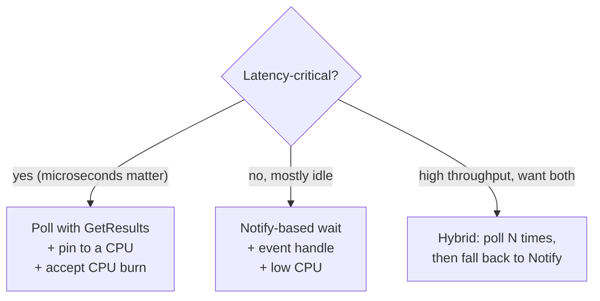

# Asynchronous Completions

NetworkDirect is built around Win32 overlapped I/O. That means every
"long" operation can either complete immediately on the calling thread
**or** complete asynchronously, and the SPI uses a fixed set of
conventions to tell you which one happened. This page documents those
conventions, the two ways to wait for completion (poll vs. notify), and
how to wire ND into IOCP-based servers.

> Reference: [IND2Overlapped](../references/IND2Overlapped.md),
> [IND2CompletionQueue](../references/IND2CompletionQueue.md).

## 1. Two completion mechanisms

ND has two distinct completion paths and you must understand the
difference:

| Mechanism | Returned through | Used by |
|-----------|------------------|---------|
| **Overlapped completion** | `IND2Overlapped::GetOverlappedResult` on an `OVERLAPPED` struct you supplied. | Setup-time and control-plane operations: `Register`, `Connect`, `Accept`, `Disconnect`, `Notify`, etc. |
| **Completion queue (CQ) entry** | `IND2CompletionQueue::GetResults` filling in an `ND2_RESULT`. | Data-plane operations: `Send`, `Receive`, `Read`, `Write`, `Bind`, `Invalidate`. |

The overlapped path is for "this happens occasionally" events. The CQ
path is for "this happens many thousands of times per second" events,
and is the one you optimize.

## 2. The HRESULT contract every overlapped call obeys

When you call an ND function that takes `OVERLAPPED*`, three return
values are possible:

| HRESULT | Meaning | What you do next |
|---------|---------|------------------|
| `ND_SUCCESS` | Done. The OVERLAPPED was **not** used. No IOCP packet. No event signal. | Move on. |
| `ND_PENDING` | Queued. Completion will arrive later. | Wait via `GetOverlappedResult`, IOCP, or event. |
| Anything else | Failed immediately. The OVERLAPPED was **not** used. | Handle the error. |

Two of these are non-obvious:

- **`ND_SUCCESS` skips the OVERLAPPED entirely.** Providers internally
  set `FILE_SKIP_COMPLETION_PORT_ON_SUCCESS` and
  `FILE_SKIP_SET_EVENT_ON_HANDLE`. Don't wait for an event you'll never
  get.
- **Errors are immediate.** If you get any non-pending error from the
  initial call, there is no asynchronous follow-up. Don't try to drain
  IOCP "just in case".

The idiomatic wrapper:

```cpp
OVERLAPPED ov{};
ov.hEvent = CreateEvent(nullptr, FALSE, FALSE, nullptr);

HRESULT hr = pMr->Register(buf, len, flags, &ov);
if (hr == ND_PENDING)
    hr = pMr->GetOverlappedResult(&ov, /*wait=*/ TRUE);
if (FAILED(hr))
    /* handle */;
```

[ndtestutil.cpp](../../src/examples/ndtestutil/ndtestutil.cpp) repeats
this exact pattern for `Register`, `GetConnectionRequest`, `Connect`,
`Accept`, `Disconnect`, and `Notify`. Steal the pattern.

## 3. Reading the CQ: `GetResults`

`GetResults` is a pure user-mode probe. It never blocks, never traps
into the kernel, and reports up to `nResults` completed work requests:

```cpp
ND2_RESULT results[8];
ULONG n = pCq->GetResults(results, 8);
for (ULONG i = 0; i < n; ++i) {
    auto& r = results[i];
    // dispatch on r.RequestType / r.RequestContext
}
```

Three things to know:

- **Return value is the number filled.** Zero means nothing is ready.
- **Always loop until you get back fewer than `nResults`.** Hardware can
  add entries between two calls, and a partial fill means "you have
  drained the CQ for now". A return of `nResults` means "there might be
  more".
- **Drain after every Notify completion.** More on this in §4.

`GetResults` is the right primitive when:

- You're in a tight latency loop and burning a CPU core is acceptable.
- You're combining multiple sources of work (e.g. one thread handling
  CQ + work queue + timers).

## 4. Blocking on the CQ: `Notify` + an event

`Notify` arms the CQ so that the next eligible completion fires an
overlapped event. The dance:

```cpp
OVERLAPPED ov{};
ov.hEvent = CreateEvent(nullptr, FALSE, FALSE, nullptr);

for (;;) {
    // Drain everything currently visible.
    ND2_RESULT r;
    while (pCq->GetResults(&r, 1) == 1) {
        handle(r);
    }

    // Arm the CQ for the *next* completion.
    HRESULT hr = pCq->Notify(ND_CQ_NOTIFY_ANY, &ov);
    if (hr == ND_PENDING)
        hr = pCq->GetOverlappedResult(&ov, /*wait=*/ TRUE);

    // After Notify completes, loop back and drain again.
}
```

Why the **drain-then-arm-then-drain** pattern? Because Notify is
edge-triggered — it completes for completions that arrive *after* it
was armed. Without the drain-first step, an entry sitting in the CQ
when you call Notify might never wake you up. The provider implementation
notes spell this out:

> The Notify overlapped requests are completed if there are new
> completions since the last notification. The completions that
> triggered the overlapped request to be completed will not cause a
> subsequent Notify request to be completed.

### Notify types

```cpp
pCq->Notify(type, &ov);
```

| `type` | Wakes on |
|--------|----------|
| `ND_CQ_NOTIFY_ANY` | Any successful completion. |
| `ND_CQ_NOTIFY_SOLICITED` | Only on a Receive that matched a Send carrying `ND_OP_FLAG_SEND_AND_SOLICIT_EVENT`. |
| `ND_CQ_NOTIFY_ERRORS` | Only on a completion-queue error / overrun. |

`ND_CQ_NOTIFY_ANY` is the right default. Use `ND_CQ_NOTIFY_SOLICITED`
for low-priority background traffic where you only want to wake on
explicitly marked "important" messages. `ND_CQ_NOTIFY_ERRORS` is a
dedicated channel for catastrophic CQ failures (overrun, hardware) —
useful in a separate monitoring thread.

## 5. Polling vs. notify: when to use which



A common hybrid loop the ND test utility uses:

```cpp
void WaitForCompletion(std::function<void(ND2_RESULT*)> on, bool blocking) {
    for (;;) {
        ND2_RESULT r;
        if (pCq->GetResults(&r, 1) == 1) {
            on(&r);
            return;
        }
        if (!blocking) continue;          // pure poll

        // Arm + block.
        OVERLAPPED ov{};
        ov.hEvent = m_event;
        HRESULT hr = pCq->Notify(ND_CQ_NOTIFY_ANY, &ov);
        if (hr == ND_PENDING)
            pCq->GetOverlappedResult(&ov, TRUE);
    }
}
```

Reuse this pattern. Note that `blocking=false` is a busy-loop — fine for
benchmarks, deadly for a server with many idle connections.

## 6. Integrating with an I/O completion port

The handle returned from `IND2Adapter::CreateOverlappedFile` is just a
Win32 file handle. Bind it to an IOCP exactly as you would any other
async handle:

```cpp
HANDLE hIocp = CreateIoCompletionPort(INVALID_HANDLE_VALUE,
                                      nullptr, /*key=*/ 0, /*threads=*/ 0);
CreateIoCompletionPort(hFile, hIocp, /*key=*/ 0, 0);
```

After that:

- Every overlapped op you submit through ND will queue an IOCP packet
  **when it returns `ND_PENDING`**.
- The `OVERLAPPED*` pointer in the IOCP packet is the one you passed
  in — embed it inside a struct of your own to carry context:

  ```cpp
  struct NdCompletion : OVERLAPPED {
      enum Kind { CqNotify, Register, Connect } kind;
      // your fields...
  };
  ```

- You **must still call** `IND2Overlapped::GetOverlappedResult` to get
  the actual HRESULT and let the provider do any post-processing. Don't
  trust the bytes-transferred or status fields the Win32
  `GetOverlappedResult` returns — providers don't promise them.

A typical worker:

```cpp
DWORD bytes;
ULONG_PTR key;
OVERLAPPED* pOv;
GetQueuedCompletionStatus(hIocp, &bytes, &key, &pOv, INFINITE);

auto* comp = static_cast<NdCompletion*>(pOv);
switch (comp->kind) {
case NdCompletion::CqNotify: {
    HRESULT hr = pCq->GetOverlappedResult(comp, FALSE);
    // Drain the CQ.
    ND2_RESULT r;
    while (pCq->GetResults(&r, 1) == 1) { dispatch(r); }
    // Re-arm.
    pCq->Notify(ND_CQ_NOTIFY_ANY, comp);
    break;
}
case NdCompletion::Connect:
    pConnector->GetOverlappedResult(comp, FALSE);
    /* ... */
    break;
}
```

The same handle can be bound to `BindIoCompletionCallback` to dispatch
through the system thread pool instead of running your own worker
threads.

## 7. Multiple outstanding Notifies

You can have many `Notify` requests outstanding against the same CQ. A
single completion event releases **all** of them (think Windows
auto-reset-vs-manual-reset event for an analogy). This is what makes
parallel completion processing work — multiple threads can each be
waiting on a different `OVERLAPPED` for the same CQ, and a single event
wakes all of them.

In practice you rarely need more than one Notify per CQ in flight. The
exception is when several worker threads independently want to be the
next consumer of completions — give each its own OVERLAPPED.

## 8. Cancelling outstanding async ops

`IND2Overlapped::CancelOverlappedRequests` cancels every in-flight async
request against that specific interface. Pending overlapped operations
complete with `ND_CANCELED`:

```cpp
pConnector->CancelOverlappedRequests();   // abandons in-flight Connect/Accept/etc.
pCq->CancelOverlappedRequests();          // wakes any pending Notify
```

Combine with `IND2QueuePair::Flush()` to also cancel data-plane requests
queued on the QP — those will surface as `ND_CANCELED` entries in the
CQ.

`IND2Connector::Disconnect` implicitly flushes the QP, so you don't need
to flush before disconnecting.

## 9. The CQ overrun trap

The CQ has a fixed depth (`queueDepth` passed at creation). If you queue
more outstanding work across all bound QPs than fits, the next
completion overruns the CQ. The provider reports this asynchronously
through `Notify(ND_CQ_NOTIFY_ERRORS)` and **the CQ becomes unusable** —
every bound QP is now dead too. There is no recovery short of tearing
down and rebuilding.

Defensive practices:

- Size the CQ for `Σ(recvDepth + initDepth)` across every QP that will
  share it. The adapter limit is `MaxCompletionQueueDepth`.
- Treat `ND_BUFFER_OVERFLOW` and `ND_INTERNAL_ERROR` from `Notify` as
  programming bugs, not transient failures.
- If you support adapters that expose `ND_ADAPTER_FLAG_CQ_RESIZE_SUPPORTED`,
  you can grow the CQ at runtime with `IND2CompletionQueue::Resize`.

## 10. Affinity for high-throughput servers

`IND2CompletionQueue::GetNotifyAffinity` tells you which processor the
adapter will use to deliver Notify completions:

```cpp
USHORT group; KAFFINITY mask;
pCq->GetNotifyAffinity(&group, &mask);
```

If you're running a worker per CQ, pin that worker to the returned
affinity (`SetThreadGroupAffinity`). It keeps CQ data and waking thread
on the same NUMA node and dramatically reduces cross-socket cache
misses.

`CreateCompletionQueue` itself takes `group` and `affinity` parameters
so you can request a particular processor *before* you know what the
provider's natural choice would be. Pass 0/0 to take the provider's
default.

## 11. Anti-patterns to avoid

- **Calling Win32 `GetOverlappedResult` instead of
  `IND2Overlapped::GetOverlappedResult`.** The Win32 one doesn't return
  ND-specific HRESULTs, and it skips any provider post-processing.
- **Re-arming Notify without draining first.** You will miss completions
  that arrived during the gap.
- **Treating `ND_SUCCESS` as "completion will come later".** It won't.
- **Sharing one OVERLAPPED across two in-flight ops on the same
  interface.** Use a distinct OVERLAPPED per concurrent request.
- **Closing the overlapped file handle before releasing every object
  that was created with it.** Crash.
- **Using the same event handle for many in-flight ops without
  serializing.** Auto-reset events lose signals; manual-reset events
  need explicit `ResetEvent`. Keep one OVERLAPPED per concurrent op.

Next: [Memory regions & windows](./06-memory.md) — the buffer
registration model that all the SGEs you've been passing rely on.
