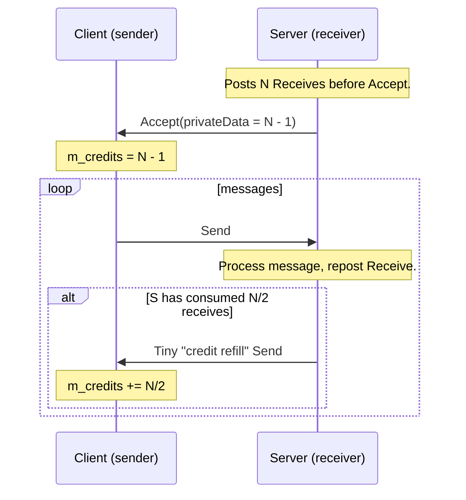
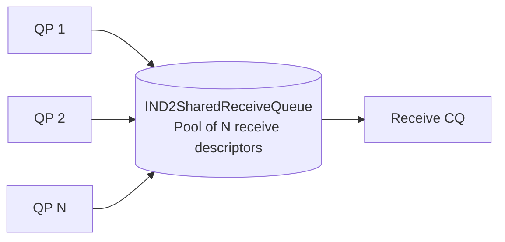

# Advanced Patterns

You can ship a working ND program with what's in the first six pages.
What turns it from "demo" into "production-ready service" is the
material on this page: flow control, shared receive queues, pipelining,
and a disciplined approach to errors.

## 1. Credit-based flow control for Send/Receive

The hardware itself does not flow-control Send/Receive — if you Send
faster than the peer can post Receives, the connection dies with
`ND_BUFFER_OVERFLOW` (or you just stop accepting messages). You have
to manage credits in software.

The canonical pattern, used by [ndping.cpp](../../src/examples/ndping/ndping.cpp):



The implementation pieces:

1. **Advertise initial credits during connection.** The server posts
   `m_queueDepth` Receives, then accepts with `privateData =
   m_queueDepth - 1` (one held back to absorb a SYNC). The client
   stashes that value as `m_nCredits`.
2. **Spend a credit per Send.** Decrement on submit; refuse to Send when
   credits = 0.
3. **Refill in batches.** Every time the server has consumed half its
   receives, it sends a tiny "I have room for N/2 more" message back.
   The client adds N/2 to its credit counter on receipt.
4. **Batching credit messages.** Crediting per message would double the
   wire traffic. Batching at `queueDepth/2` is a good default.

This pattern keeps the wire busy (always something in flight) without
ever over-running the peer's receive queue. Skipping it is the most
common cause of "my benchmark drops messages under load".

## 2. Shared receive queues (SRQ)

When you have many concurrent connections, per-QP Receive queues become
expensive: each must be sized for the worst-case burst, even if most
QPs sit idle. An SRQ pools Receive descriptors across many QPs.



Trade-offs:

- + Memory savings: pool one big buffer instead of `N × per-QP backlog`.
- + Adaptive: hot QPs naturally consume more receive slots.
- − No per-connection flow control: a noisy peer can drain the pool.
  Use only when you trust the peers.
- − Optional feature: check `MaxSharedReceiveQueueDepth` in
  `ND2_ADAPTER_INFO`. Zero means the adapter doesn't support it.

Setup:

```cpp
IND2SharedReceiveQueue* pSrq = nullptr;
pAdapter->CreateSharedReceiveQueue(IID_IND2SharedReceiveQueue, hFile,
                                   /*queueDepth*/ 1024,
                                   /*maxSge*/ 1,
                                   /*notifyThreshold*/ 128,
                                   /*group*/ 0, /*affinity*/ 0,
                                   reinterpret_cast<void**>(&pSrq));

// Use the WithSrq variant for every QP.
pAdapter->CreateQueuePairWithSrq(IID_IND2QueuePair,
                                 pRecvCq, pInitCq, pSrq,
                                 /*ctx*/ nullptr,
                                 /*initDepth*/ 64,
                                 /*maxInitSge*/ 1,
                                 /*inlineSize*/ 64,
                                 reinterpret_cast<void**>(&pQp));

// Post receives on the SRQ — *not* on individual QPs.
ND2_SGE sge{ recvBuf, recvLen, pMr->GetLocalToken() };
pSrq->Receive(/*ctx*/ recvBuf, &sge, 1);
```

The `notifyThreshold` is the "tell me when this many slots are free or
fewer" watermark. Arm it like a CQ Notify:

```cpp
pSrq->Notify(&ov);
// When the callback fires you know the pool is running low — refill.
```

Refill aggressively when notified; a starved SRQ means incoming Sends
have nowhere to land.

## 3. Pipelining initiator work

Posting one Send and waiting for its completion before posting the next
gives you ping-pong latency, not throughput. Throughput comes from
keeping `MaxInitiatorQueueDepth` requests in flight at all times.

The pattern, lifted from
[ndrping's `IssuePings`](../../src/examples/ndrping/ndrping.cpp):

```cpp
DWORD outstanding = 0;
const DWORD limit = m_availCredits;     // peer-advertised, or MaxInitiatorQueueDepth

for (ULONG i = 0; i < iterations; ) {
    // Refill: post as many as we have credits and work for.
    while (outstanding < limit && i < iterations) {
        pQp->Write(sgl, nSge, remoteAddr, remoteToken, flags, ctx);
        ++outstanding; ++i;
    }

    // Reap one or more completions, freeing credits.
    ND2_RESULT r;
    if (pCq->GetResults(&r, 1) == 1) {
        if (r.Status != ND_SUCCESS) return;
        --outstanding;
    } else if (blockingMode) {
        ArmNotifyAndWait();
    }
}

// Drain remaining completions.
while (outstanding) {
    ND2_RESULT r;
    if (pCq->GetResults(&r, 1) == 1) {
        if (r.Status != ND_SUCCESS) return;
        --outstanding;
    }
}
```

Key knobs:

- Pick `limit = min(MaxInitiatorQueueDepth, peerCredits,
  MaxOutboundReadLimit (for Read))`.
- The CQ must be ≥ `limit` per QP that shares it.
- Adding `ND_OP_FLAG_SILENT_SUCCESS` on Writes you don't need confirmed
  individually cuts CQ pressure roughly in half.

## 4. Request-context bookkeeping

`RequestContext` is your one channel for matching completions back to
in-flight requests. Three lightweight conventions used in the bundled
examples:

```cpp
#define RECV_CTXT  ((void*) 0x1000)
#define SEND_CTXT  ((void*) 0x2000)
#define READ_CTXT  ((void*) 0x3000)
#define WRITE_CTXT ((void*) 0x4000)
```

A constant per request *type* is enough when you only care about the
kind, not the specific request. For higher fidelity:

```cpp
struct RequestSlot {
    enum Kind { Send, Recv, Read, Write } kind;
    void*    buffer;
    uint32_t length;
    uint64_t seqno;
};

RequestSlot pool[N_OUTSTANDING];

// At submission:
auto* slot = pool + nextFreeIndex();
slot->kind = RequestSlot::Send; /* ... */
pQp->Send(slot, sgl, nSge, flags);

// At completion:
auto* slot = static_cast<RequestSlot*>(r.RequestContext);
recycle(slot);
```

Don't allocate per request — that defeats the whole point of
kernel-bypass. Pool everything.

## 5. Graceful shutdown

A clean shutdown ordering, on either side:

1. Stop posting new initiator requests.
2. (Optional) Post a small "I am done" Send so the peer can finish
   in-flight work on its side.
3. Wait for all your in-flight completions to drain.
4. `Disconnect(&ov)` — this implicitly Flushes the QP, so anything still
   in flight surfaces with `ND_CANCELED`.
5. `pMr->Deregister(&ov)`, `pMr->Release()`, then Release everything
   else in reverse-creation order.

If the peer disconnects first, you get woken up via:

- Outstanding work requests completing with `ND_CANCELED`.
- A `NotifyDisconnect(&ov)` you previously posted completing.
- Your `Notify(ND_CQ_NOTIFY_ERRORS)` firing (catastrophic disconnect).

Make sure your event loop handles all three.

## 6. Error handling discipline

The ND SPI has two distinct categories of failure:

### Connection-fatal errors

Any completion status that isn't `ND_SUCCESS` or `ND_CANCELED` is
**connection-fatal**. The QP moves to the Dead state, every other
in-flight request on it completes with `ND_CANCELED`, and you cannot
reuse the QP. Recovery:

1. Drain remaining `ND_CANCELED` completions from the CQ.
2. Release the QP, connector, and (if it was per-connection) any MR/MW.
3. Decide whether to reconnect. If yes, create a fresh QP and
   connector against the existing adapter.

### Adapter-fatal errors

`ND_DEVICE_REMOVED` from any call means the NIC went away (driver
crash, hot-unplug, sleep state). Every object on it is now dead.
Recovery:

1. Release everything.
2. Call `NdCleanup` / `NdStartup`.
3. Wait for the NIC to come back, re-enumerate addresses, re-open the
   adapter.

The same is true for `ND_INTERNAL_ERROR` on a Notify completion — the
CQ is unusable and so is every QP attached to it.

### Recoverable, request-level errors

A few statuses are *not* fatal. Treat them carefully:

| Status | When | Response |
|--------|------|----------|
| `ND_PENDING` | After any overlapped call | Normal — wait. |
| `ND_NO_MORE_ENTRIES` on Send/Receive | You exceeded the QP's queue depth | Back off; reap completions before retrying. |
| `ND_BUFFER_OVERFLOW` on Query/QueryAddressList | Buffer too small | Resize and retry. |
| `ND_NOT_SUPPORTED` | Optional feature not present | Skip or fall back. |

### A defensive submission helper

```cpp
HRESULT SafeSend(IND2QueuePair* qp, void* ctx,
                 const ND2_SGE* sgl, ULONG nSge, ULONG flags) {
    for (;;) {
        HRESULT hr = qp->Send(ctx, sgl, nSge, flags);
        if (hr != ND_NO_MORE_ENTRIES) return hr;
        // Submit queue is full — drain some completions first.
        ReapCq();
    }
}
```

Don't make the helper retry on connection-fatal errors. Those need to
bubble up.

## 7. Choosing between Send/Receive and RDMA

A practical recipe:

1. Query `LargeRequestThreshold` from `ND2_ADAPTER_INFO`.
2. If `messageSize >= LargeRequestThreshold`, prefer RDMA Write.
   Otherwise, prefer Send/Receive.
3. For Sends, if `messageSize < InlineRequestThreshold`, set
   `ND_OP_FLAG_INLINE`.
4. For one-sided traffic where the remote CPU absolutely should not be
   woken on every transfer, use RDMA Write + sentinel byte or
   `ND_OP_FLAG_SEND_AND_SOLICIT_EVENT` on a trailing Send.
5. For request/reply RPC, Send/Receive is almost always the right
   answer — the wakeup is built in and you don't need to publish
   buffers.

## 8. Multi-engine and CQ affinity

If the adapter advertises `ND_ADAPTER_FLAG_MULTI_ENGINE_SUPPORTED`,
multiple CQs can progress on separate hardware engines in parallel. To
benefit:

- Use one CQ per worker thread.
- Pin each worker to the affinity returned by
  `IND2CompletionQueue::GetNotifyAffinity` (or pass an explicit one to
  `CreateCompletionQueue`).
- Spread QPs across CQs by connection.

`ND_ADAPTER_FLAG_CQ_INTERRUPT_MODERATION_SUPPORTED` lets the provider
coalesce interrupts to improve throughput at the cost of slightly
higher latency on idle paths — usually you accept the provider default.

## 9. Loopback for testing

If the adapter exposes `ND_ADAPTER_FLAG_LOOPBACK_CONNECTIONS_SUPPORTED`,
you can connect to your own NIC's IP. Loopback exercises the entire
provider stack without two physical machines and is a great way to
debug your protocol. Performance numbers from loopback are not
representative — they bypass the wire.

## 10. Debugging tips

- Run [ndcat](../../src/examples/ndcat/ndcat.cpp) first to confirm the
  IP you're using is recognised.
- Run [ndadapterinfo](../../src/examples/ndadapterinfo/ndadapterinfo.cpp)
  and validate every limit you depend on at runtime.
- Run [ndpingpong](../../src/examples/ndpingpong/ndpingpong.cpp)
  between the two machines to confirm the fabric. If single-byte latency
  is in the hundreds of microseconds, your problem is the fabric not
  your code.
- Add request contexts that encode "what was this for". When something
  goes wrong, `r.RequestContext` is your only clue.
- Turn on the `ND_OP_FLAG_SILENT_SUCCESS` only after correctness is
  proven — losing a success completion can hide a state-machine bug.

## 11. Where to from here

You now have the full picture: the SPI shape, the lifecycle rules, the
connection handshake, the data verbs and their ordering, the
completion model, the memory model, and the patterns that make all of
it perform.

If you need exhaustive parameter detail on any specific method, head
back to the reference docs from the [tutorial index](../README.md).
